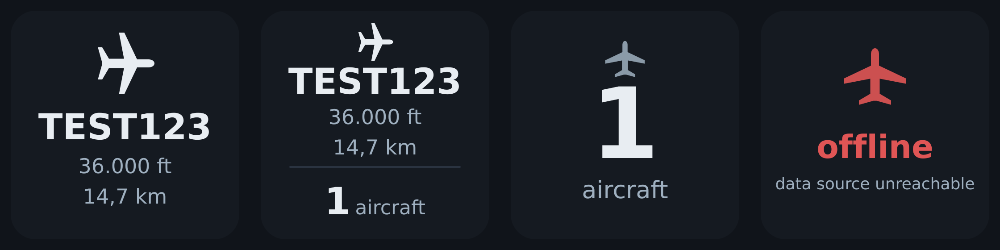

# WhatsAbove

**Live ADS-B data on your Elgato Stream Deck** — an [OpenDeck](https://github.com/nekename/OpenDeck) plugin.

<p align="center">
  
</p>

WhatsAbove turns Stream Deck keys into live ADS-B displays. It reads real-time
aircraft data from a [dump1090-fa](https://github.com/edsb/dump1090-fa) /
[piaware](https://github.com/flightaware/adsb-pi) receiver (e.g. running on a
Raspberry Pi with a [RTL-SDR](https://rtlsdr.org/) antenna) and renders it
directly onto the button — no web page required.

- **Nearest flight** — the closest aircraft that reports position: callsign,
  barometric altitude and distance to the antenna; the jet icon points in the
  aircraft's direction of travel.
- **Aircraft counter** — how many transponders your antenna is currently seeing.
- **Both** — nearest flight on top, live counter below.
- **Offline state** — a clear red "offline" indication when the receiver is
  unreachable.
- **Opens your receiver UI** — pressing the key opens a configurable URL
  (SkyAware, fr24feed, a flight tracker, …) in your browser.

Every value updates live (default: every 5 seconds). Display mode, data source,
URL, refresh rate and the font size of each line are configurable per key.

## Requirements

- [OpenDeck](https://github.com/nekename/OpenDeck) — the Tauri-based Stream
  Deck application
- Node.js ≥ 20 on the machine running OpenDeck (the plugin itself has **no**
  npm dependencies)
- A receiver exposing the dump1090-fa JSON API on port 8080 —
  `/data/aircraft.json` and `/data/receiver.json`. The
  [piaware](https://github.com/flightaware/adsb-pi) stack provides both out of
  the box.

Tested on Linux (x86_64, aarch64). The plugin is pure JavaScript without
platform-specific code, so it should also work on Windows and macOS.

> Button icons and the property inspector are available in English and
> German (per-key **Language** setting, default: English).

## Installation

Copy the plugin folder `whatsabove.sdPlugin/` into your OpenDeck
plugins directory:

| OS | Plugins directory |
| --- | --- |
| Linux | `~/.config/opendeck/plugins/` |
| macOS | `~/Library/Application Support/opendeck/plugins/` |
| Windows | `%APPDATA%\opendeck\plugins\` |

or run `bash tools/install.sh` on Linux (the folder name *is* the plugin UUID,
as expected by OpenDeck).

Then restart OpenDeck (or reload plugins) and drag the **ADS-B Live** action
from the *WhatsAbove* category onto a key. Right-click the key →
*Einstellungen* to configure it.

## Configuration (per key)

| Setting | Default | Meaning |
| --- | --- | --- |
| **Language** (Sprache) | English | language of the button icons and this settings dialog (🇬🇧 English / 🇩🇪 Deutsch) |
| **Anzeige** (display mode) | *Nächstes Flugzeug* | nearest flight / aircraft counter / both |
| **Datenquelle** (data source) | `0.0.0.0` | base URL of the dump1090-fa / SkyAware web interface (origin only — `/data/aircraft.json` & `/data/receiver.json` are appended automatically) |
| **URL beim Drücken** (URL on press) | `http://0.0.0.0:8080/` | opened in the browser when the key is released |
| **Refresh (s)** | `5` | how often `aircraft.json` is fetched (1–120 s) |
| **Schriftgröße Ident** | `80` | callsign line font size, adjustable with the − / + buttons (24–140) |
| **Schriftgröße Höhe** | `46` | altitude line font size (20–80) |
| **Schriftgröße Entfernung** | `46` | distance line font size (20–80) |

In *Both* mode the three lines are capped at 84 / 64 / 64 so the counter below
still fits.

> The default data source (`0.0.0.0`) is a placeholder — set it to the IP of
> your receiver, e.g. the Raspberry Pi running piaware
> (`http://192.168.1.100:8080`).

### How the data is used

- **Counter** = `aircraft.length` in `aircraft.json` (all heard transponders,
  including those without position).
- **Nearest flight** = aircraft with the smallest great-circle (Haversine)
  distance to the antenna position from `receiver.json`. Aircraft without
  `lat`/`lon` are ignored for this purpose.
- Altitude is `alt_baro` (barometric, feet); a missing value simply hides that
  line.

## Development

```bash
# regenerate the static icons (pure Node, no dependencies)
node tools/gen-icons.js

# regenerate the README preview images in docs/
bash tools/make-screenshots.sh

# integration test: mock OpenDeck + mock data source
bash tools/run-test.sh
# …with custom settings:
bash tools/run-test.sh '{"mode":"count","dataHost":"http://192.168.1.100:8080","refresh":2}'
```

`tools/mock-opendeck.js` emulates OpenDeck (register → willAppear →
keyDown/keyUp), logs every `setImage`/`openUrl` event and saves the rendered
SVG icons into `tools/out/` — the plugin can be developed and tested without a
real Stream Deck. `tools/mock-data-server.js` serves a deterministic synthetic
`aircraft.json`/`receiver.json` for reproducible layout tests.

## Repository layout

| Path | Purpose |
| --- | --- |
| `whatsabove.sdPlugin/` | the plugin (the only part that needs to be installed) |
| `whatsabove.sdPlugin/plugin.js` | WebSocket loop, data fetch, SVG rendering, URL opening |
| `whatsabove.sdPlugin/wsclient.js` | minimal WebSocket client (Node 20 has no global `WebSocket`) |
| `whatsabove.sdPlugin/propertyInspector/` | per-key settings UI (HTML/CSS/JS) |
| `whatsabove.sdPlugin/icons/` | static 512 px icons |
| `tools/` | dev tooling: mock OpenDeck, mock data source, icon generator, install & test scripts |
| `docs/` | README preview images |

## License

[MIT](LICENSE)
